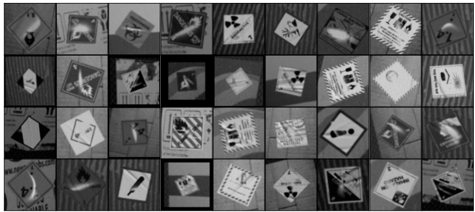

# DL-Hazmat
<!-- This is the dataset released in the following paper: [Towards On-Device Continual Learning with Binary Neural Networks in Industrial Scenarios](...)    -->

## News
- ⚡(2024-07-31): We have released the dataset, please visit the [download section](#download) to get the dataset.

---

## Dataset description


DL-Hazmat is a synthetic dataset for benchmarking continuous hazardous material symbol recognition methods focusing on industrial applications. Hazardous materials symbols (known also as warning or safety symbols) are visual indicators designed to convey information about potential hazards associated with specific materials, locations, or objects.

DL-Hazmat is composed by:
- more than 260K annotated grayscale images splitted in 10 experiences as training set and 25K annotated grayscale images for test set
- 64 hazmat classes, 23 hazmat grouped dataset
- 72 different parcels/envelopes background.

The dataset is provided using zip archives to improve the download time and bandwith, the cloud file structure is:

```
Cloud
  ├── train
  |   ├── train_experience_0.zip
  |   ├── train_experience_1.zip
  |   ├── train_experience_2.zip
  |   └── ...
  ├── test
  |    └── test_experience_0.zip
  ├── map_class_grouped.json
  └── map_class.json
```
<div align="center">


<span> Example images of the 64 Hazmat symbols in DL-Hazmat. Each sub-figure denotes a different class</span>
</div>


## Download
To get the access to the dataset please send an email to: 

- [lorenzo.vorabbi@datalogic.com](lorenzo.vorabbi@datalogic.com) 

or:

- [angelo.carraggi@datalogic.com](angelo.carraggi@datalogic.com) 


the dataset can be downloaded at this <ins><span style="font-size:20px;">[link](https://datalogicgroup-my.sharepoint.com/:f:/r/personal/angelo_carraggi_datalogic_com/Documents/dl-hazmat-dataset?csf=1&web=1&e=dddGZE)</span></ins>.


### Extraction

- Install requirements
    ```bash
    git clone https://github.com/acarraggi/dl-hazmat.git
    cd dl-hazmat
    # Install the dependencies for downloader and viewer
    pip install -r requirements.txt
    ```

- Run the script:
    ```bash
    python extract_dataset.py --outdir="./dataset" --type="train, test" --zip_folder_path="./data"
    ```
### Extra tool
- Data viewer:
    ```bash
    python data_viewer.py --dataset_root_path="./dataset" --type="train" --experience=0
    ```

## Dataset structure
  ```
  DL-Hazmat
  ├── train
  |   ├── experience_0
  |   |   ├── hazmat_class_1
  |   |   |   ├── backgrounds
  |   |   |   |   ├── background01.bmp
  |   |   |   |   └── ...
  |   |   |   ├── gts
  |   |   |   |   ├── 0.txt
  |   |   |   |   └── ...
  |   |   |   ├── 0.jpg
  |   |   |   ├── 1.jpg
  |   |   |   └── ...
  |   |   └── ...
  |   ├── experience_1
  |   |   ├── hazmat_class_1
  |   |   |   ├── backgrounds
  |   |   |   |   ├── background01.bmp
  |   |   |   |   └── ...
  |   |   |   ├── gts
  |   |   |   |   ├── 0.txt
  |   |   |   |   └── ...
  |   |   |   ├── 0.jpg
  |   |   |   ├── 1.jpg
  |   |   |   └── ...
  |   |   └── ...
  |   └── ...
  ├── test
  |   ├── experience_0
  |   |   ├── hazmat_class_1
  |   |   |   ├── backgrounds
  |   |   |   |   ├── background01.bmp
  |   |   |   |   └── ...
  |   |   |   ├── gts
  |   |   |   |   ├── 0.txt
  |   |   |   |   └── ...
  |   |   |   ├── 0.jpg
  |   |   |   ├── 1.jpg
  |   |   |   └── ...
  |   |   └── ...

  ```


## License
This DL-Hazmat dataset is made freely available to academic and non-academic entities for non-commercial purposes such as academic research, teaching, scientific publications, or personal experimentation. 

Permission is granted to use the data given that you agree to our [license terms](License.md).

